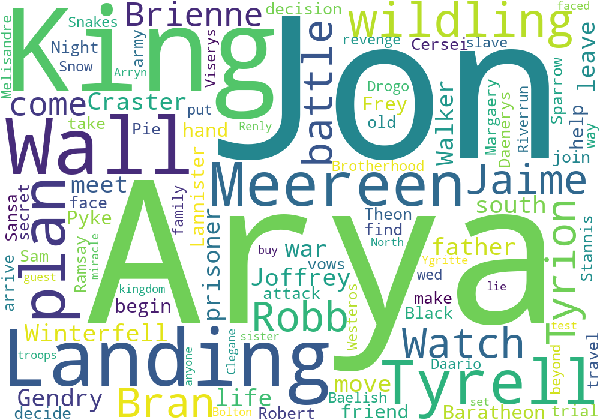
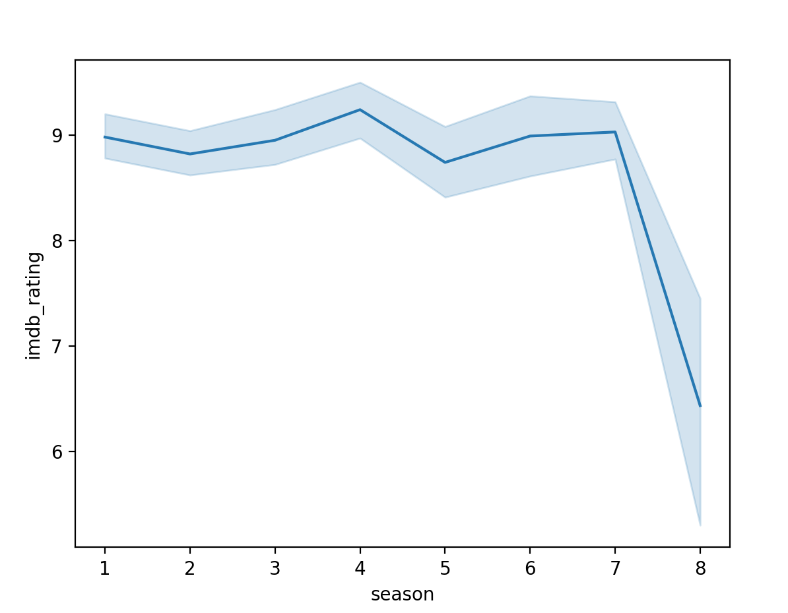

# Game-of-Throne-Data-Analysis-Project
This project analyse the whole season Game-of-Thrones data including the ratings of each season,  each director as well as other data using Python and Spark.

# Environment
JDK8  
Hadoop 2.7.1  
Spark 3.2.1  
Scala 2.12.15  
Python 3.8  
Pandas 1.3.5  
matplotlib 3.2.2  
word cloud 1.5.0  
seaborn 0.11.2  

# Datasets
Stored in Datasets folder. There are two csv files including data about episode, ratings and episode summary description, respectively.

# Analysis Part

## Pre-processing
Firstly we read the files and use parse_dates parameter is to format data type.We notice that there are same columns in two files. So we decide to merge them into one file based on title and publish date. Then we ouput the newly merged file.

## Spark part
We put the merged file into hadoop directory, start the hdfs `./sbin/start-dfs.sh` and put the file into hdfs `./bin/hdfs dfs -put game_of_thrones.csv /user/username/data`.

After uploading the file, we enter spark-shell and read the file into dataframe type 
using `val data =spark.read.format("csv").option("header","True").load("game_of_thrones.csv")` and get single word in description column using `val desc_df=data.select(data("desc"))`.

To analyse the count of each word, we need to get the most used words using `words = words.groupBy("value").count().orderBy($"count".desc)`. However, there are some meaningless prepsitions and articles. So we delete them from the dataframe and saved to csv file by command
`words.write.option(“header”,“true”).csv(“words.csv”).`

We select the most liked and disliked show and their information based on their imdb_rating using `val last_video_msg = data.orderBy("imdb_rating").first()` and `val first_video_msg = = data.orderBy("imdb_rating".desc).first()`.

We create a new dataframe to store season and imdb_rating information for calculating the average rating of each season. `val season_df =data.select(data("season"),data("imdb_rating").cast("float"))`, `def avg_rating(i:Any):org.apache.spark.sql.DataFrame ={return season_df.filter($"season".equalTo(
i)).agg(mean($"imdb_rating")as "mean rating_"+i).toDF()}`

We generate another csv file about directors and average ratings of TV shows directed by each of them.

## Python part
Here we will show the result of our analysis.

We load the words.csv file which contains separated word of descriptions and generate word cloud for that file.

The imdb_rating suffers a sharp decline in season 8.

